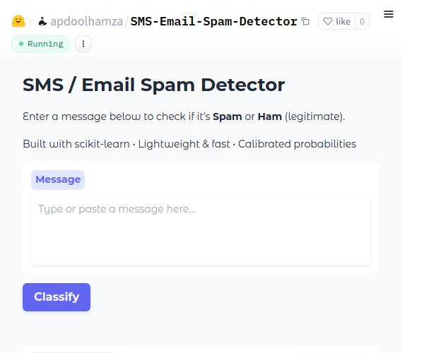

<h1 align="center">
  SMS / Email Spam Detection System
</h1>

<h1 align="center">

[](https://www.python.org/)
[](https://scikit-learn.org/)
[](https://opensource.org/licenses/MIT)
[](https://github.com/apdoolhamza/SMS-Email-Spam-Detector/blob/main/Docs/SMS_Email_Spam_Classifier.pdf)
[](https://www.kaggle.com/code/apdoolhamza/sms-email-spam-classifier)
[](https://huggingface.co/spaces/apdoolhamza/SMS-Email-Spam-Detector)

</h1>

A lightweight, production-ready Spam Classifier for SMS and short emails. Achieves F1-score ~0.88 on spam class with extremely low false positives using scikit-learn.

Built with clean engineering practices perfect for real-world deployment in telecom, email gateways, or personal security tools.

<p align="center">
  <a href="https://huggingface.co/spaces/apdoolhamza/SMS-Email-Spam-Detector">
    
  </a>
</p>

## Key Features

- Professional text cleaning + domain-specific engineered features  
- TF-IDF + numeric feature pipeline (length, keyword flags, punctuation)  
- HalvingGridSearchCV hyperparameter tuning  
- Isotonic probability calibration for trustworthy confidence scores  
- Full evaluation suite (ROC, PR curves, confusion matrix)  
- Model saved with joblib (fast loading & compression)  
- Ready for deployment  

## Demo

[](https://huggingface.co/spaces/apdoolhamza/SMS-Email-Spam-Detector)

## Results Summary

| Metric              | Value (Spam class) |
|---------------------|--------------------|
| F1-score            | ~ 0.88             |
| Precision           | ~ 0.92             |
| Recall              | ~ 0.8591           |
| ROC-AUC             | > 0.97             |
| Inference speed     | < 10 ms / message  |

## Installation & Usage

```bash
pip install -r requirements.txt
```

## Why This Project Matters

In 2026, spam and AI-powered phishing cost businesses billions annually. This system demonstrates how a well-engineered classic ML solution can deliver enterprise-grade performance with minimal resources.

## License
This project is licensed under the MIT License – see the LICENSE file for details.

## Acknowledgments

* UCI SMS Spam Collection Dataset
* scikit-learn community

## Contact / Contributing

Feel free to open an issue or submit a pull request.

## Author

```
Apdoolmajeed Hamza (apdoolhamza)
AI/ML Engineer | Full-stack Web Developer
```
- LinkedIn: https://www.linkedin.com/in/apdoolhamza/
- GitHub:   https://github.com/apdoolhamza/
